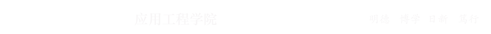
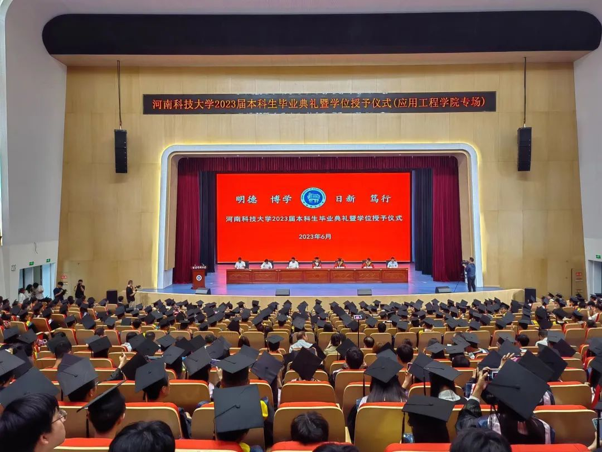
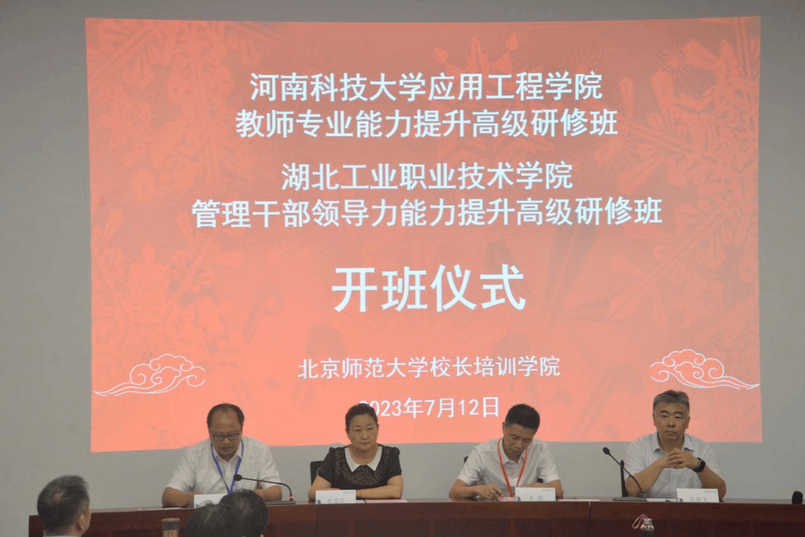
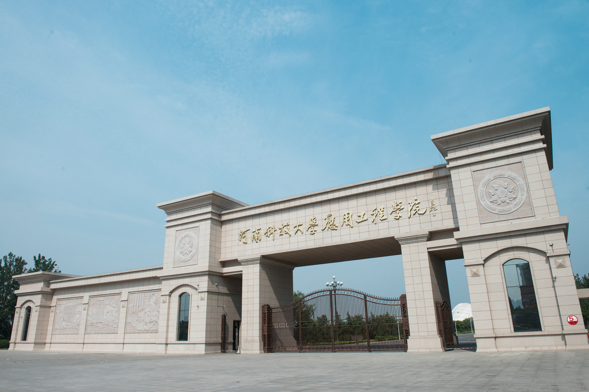
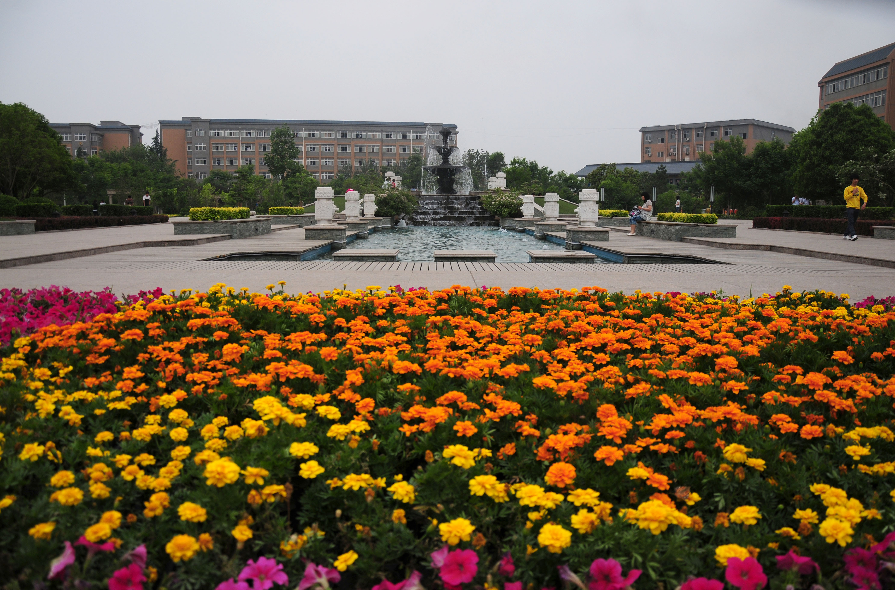
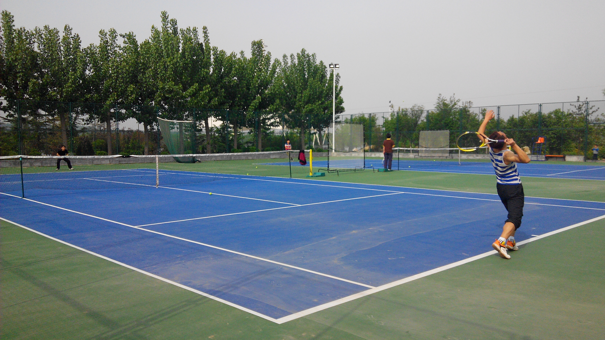

# 第一章    绪论

## 1.1    课程描述

​        本课程旨在介绍设计应用工程学院网页的基本概念和技术，包括HTML、CSS以及部分JavaScript知识的使用方法，以及网页设计的思想和原则。

## 1.2    课程设计目的

- 根据先有知识设计应用工程学院官网首页,以便于更好的检索与了解学院，学院最新消息、通知公告等

- 利用flex等实现弹性布局,以便于网页更好的适配各种浏览器、各种设备
- 利用元素的position属性来指定元素的位置
- 通过设计本课程，将掌握网页设计的基本原理和技巧，提高自己的设计能力，并能够应用所学知识解决实际问题

- 掌握网页设计的相关知识，包括网页设计的理论基础、设计方法、设计工具等
- 具备网页设计的能力，能够独立完成网页设计的各个环节

# 第二章    网页设计思想分析

在网页设计中，布局和结构是非常重要的因素。良好的布局可以使网页看起来整洁、有序，并且易于阅读和导航。同时，合理的结构可以使网页的内容层次清晰，用户可以轻松地找到所需信息。

**布局思路**：先整体再局部，从外到内，从上到下，从左到右

**CSS 实现思路** :

- 画盒子，调整盒子范围 → 宽高背景色 

- 调整盒子位置 → flex 布局、内外边距 

- 控制图片、文字内容样式


# 第三章    网页设计

在网页设计中，需要考虑以下几个方面：

- 页面主题和目标：确定网页的主题和目标，以便能够有针对性地设计页面的内容和布局

- 色彩和图像选择：选择适合主题和目标的色彩和图像，以提升页面的视觉效果和吸引力

- 文字和字体选择：选择合适的字体和文字样式，以确保页面的可读性和易于理解

- 导航和链接设计：设计清晰明了的导航菜单和链接，使用户能够轻松地浏览和导航网页

- 响应式设计：考虑不同设备和屏幕尺寸的兼容性，确保网页在各种设备上都能够良好显示和使用

## 3.1 logo模块

> 

## 3.2 nav导航栏模块

> 

## 3.3 focus轮播图模块

> 

## 3.4 content内容模块

> 

## 3.5 show展示模块

> 

## 3.6 inform通知模块

> 

## 3.7 footer页脚模块

> 

# 第四章    网页设计实现

在网页设计实现过程中，需要掌握以下技术：

- HTML：使用HTML标记语言创建网页的结构和内容

- CSS：使用CSS样式表为网页添加样式和布局

- 图像处理：使用图像编辑软件对图像进行处理和优化，以适应网页设计需求

- 响应式设计技术：使用媒体查询和弹性布局等技术，实现网页在不同设备上的适配和响应

##  4.1 logo 模块

> - logo 功能：
>
> 	- 单击跳转到首页
>
> 	- 搜索引擎优化：**提升网站百度搜索排名**
>
> - **html:**
>
> 	```html
>	  <div class="logo">
> 	    <h1 class="logo-icon"><a href="index.html">河南科技大学应用工程学院</a></h1>
> 	  </div>
> 	```
> 
> - **css:**
>
>   ```css
>  .logo {
>     width: 100%;
>     background-color: #024089;
>     height: 156px;
>     display: flex;
>     //使用相对定位,使其中的图片相对于logo父盒子进行定位
>     position: relative;
>     //设置底部边框
>     border-bottom: #567da3 solid 1px;
>   }
>   ```
> 
>   **实现方法:** 
>
>   • 标签结构: 网站名称（搜索关键字）
>
>   ```css
>  .logo .logo-icon {
>     text-indent: -999px;     //也可以font-size: 0;
>     overflow: hidden;        //隐藏文字
>     margin: 30px auto 0px;
>   }
>   ```
> 
>   利用绝对定位,使img水平居中
>
>   ```css
>  .logo img {
>     width: 75%;
>     position: absolute;
>     left: 50%;                             //使该盒子的左边距离父亲盒子为通栏的50%
>     transform: translateX(-50%);          //使该盒子水平向左以该盒子的宽移动50%,使盒子水平居中
>   }
>   ```
> 
> - **设计效果:**
>
> 	
>
> 	

## 4.2 nav 模块

> - 导航功能 :
>
> 	- 单击跳转页面 实现方法：
>
> 	-  标签结构：ul > li * 3 > a 
>
> 	- 优势：**避免堆砌 a 标签，网站搜索排名降级**
>
> 	-  布局思路:
>
> 		 li 设置 右侧 margin a 设置 左右 padding
>
> - **html:**
>
> 	```html
>	 <nav>
> 	    <ul class="nav-list">
> 	      <li><a href="#">学校首页</a>
> 	        <ul>
> 	          <li><a href="#">图片新闻</a></li>
> 	          <li><a href="#">通知公告</a></li>
> 	          <li><a href="#">学院新闻</a></li>
> 	          <li><a href="#">专题新闻</a></li>
> 	        </ul>
> 	      </li>
> 	      <li><a href="#">学院概况</a>
> 	        <ul>
> 	          <li><a href="#">学校简介</a></li>
> 	          <li><a href="#">学校领导</a></li>
> 	          <li><a href="#">院设机构</a></li>
> 	        </ul>
> 	      </li>
> 	      <li><a href="#">教学科研</a>
> 	        <ul>
> 	          <li><a href="#">教学动态</a></li>
> 	          <li><a href="#">科研动态</a></li>
> 	          <li><a href="#">规章制度</a></li>
> 	          <li><a href="#">下载中心</a></li>
> 	        </ul>
> 	      </li>
> 	      <li><a href="#">师资队伍</a>
> 	        <ul>
> 	          <li><a href="#">专职教师</a></li>
> 	          <li><a href="#">外聘教师</a></li>
> 	        </ul>
> 	      </li>
> 	      <li><a href="#">人才培养</a>
> 	        <ul>
> 	          <li><a href="#">培养方案</a></li>
> 	        </ul>
> 	      </li>
> 	      <li><a href="#">学生工作</a>
> 	        <ul>
> 	          <li><a href="#">学生活动</a></li>
> 	          <li><a href="#">学生获奖</a></li>
> 	          <li><a href="#">学生资助</a></li>
> 	          <li><a href="#">规章制度</a></li>
> 	        </ul>
> 	      </li>
> 	      <li><a href="#">党建工作</a>
> 	        <ul>
> 	          <li><a href="#">组织机构</a></li>
> 	          <li><a href="#">政策法规</a></li>
> 	          <li><a href="#">组织动态</a></li>
> 	          <li><a href="#">学习园地</a></li>
> 	        </ul>
> 	      </li>
> 	      <li><a href="#">招生就业</a>
> 	        <ul>
> 	          <li><a href="#">招生工作</a></li>
> 	          <li><a href="#">就业工作</a></li>
> 	        </ul>
> 	      </li>
> 	      <li><a href="#">工会之家</a>
> 	        <ul>
> 	          <li><a href="#">组织机构</a></li>
> 	          <li><a href="#">工作动态</a></li>
> 	        </ul>
> 	      </li>
> 	      <li><a href="#">教务管理</a></li>
> 	    </ul>
> 	  </nav>
> 
> 	```
>
> - **css:**
>
>   ```css
>  nav {
>     background-color: #024089;
>   }
> 
>   .nav-list {
>       margin: auto;
>     width: 75%;
>     height: 47px;
>     background-color: #024089;
>     display: flex;               //给父盒子添加flex属性，来控制子盒子的位置和排列方式
>     justify-content: center;    //设置主轴上的子元素排列方式,使主轴上的子元素水平居中
>   }
> 
>   /* 注:如果想让整个模块都有pointer,可以为a设置为block */
>   
>   .nav-list>li {                //选择所有直接子元素为 <li> 的元素,且这些元素是.nav-list类的子元素
>       z-index: 1;                 //设置元素的堆叠顺序,值为 1 表示该元素在同级元素中的层级较高     position 属性会影响元素的 z-index，因此需要注意元素的层叠顺序                  
>     text-align: center; //如果不设置z-index属性则会出现重叠,因为我们要的是使二级li出现在其他div上面,所以设置为1
>     flex: 1;           //使用弹性布局,为子元素设置子项flex值,使每个li标记占总ul的一份
>     line-height: 47px; //设置行高,使文字水平垂直居中
>   }
> 
>   .nav-list li ul {
>       visibility: hidden;//将元素的可见性设置为隐藏,即子菜单在页面中不可见,这样设置可以在鼠标悬停或点击来显示子菜单
>   }
> 
>   .nav-list li:hover ul li {   //当鼠标悬停时显示的效果
>       visibility: visible;      //使子菜单项可见。默认情况下，子菜单项是隐藏的,当鼠标悬停时便解除元素的隐藏效果
>     background-color: #024089;
>   }
> 
>   .nav-list li:hover ul li:hover {  //当鼠标悬停在li上时悬停在子元素li上时显示的效果
>       background-color: #024d99;
>   }
> 
>   ```
>   
> - **设计效果:**
>
> 	
>
> 	

> - 轮播图功能:
>
> 	- 定义了一个 `.carousel` 类，用于创建一个轮播图
>
> 	- 轮播图是一个可以自动播放的图像或文本滑块
>
> 	- 布局思路:
>		- **使用容器元素：**轮播图通常使用一个容器元素来包含所有滑块,容器元素使用 flex 布局或来排列滑块
> 		- **使用子元素：**每个滑块都是一个子元素，子元素可以使用绝对定位来定位在容器元素中
> 		- **使用 transition 属性：**轮播图通常使用` transition` 属性来实现滑块的平滑切换
> 
> 	- 轮播图的滑块切换方式：
>		- **使用 JavaScript 代码：**使用 JavaScript 代码来控制滑块的切换
> 
> - **html:**
>
> 	```html
>	<div class="carousel">
> 	  <div class="container"></div>
> 	  <div class="shift">
> 	      <div class="btn left">&lt;</div>
> 	      <div class="btn right">&gt;</div>
> 	  </div>
> 	  <div class="bottom"></div>
> 	</div>
> 	```
> 
> - **css:**
>
> 	```css
>	.carousel {
> 	  width: 100%;
> 	  height: 400px;
> 	  margin: 0 auto;
> 	  overflow: hidden;           //隐藏超出部分
> 	  position: relative;         //子元素的 position 将相对于 .carousel 元素进行计算
> 	}
> 
> 	.carousel .container {
> 		  width: 100%;
> 	  height: 100%;
> 	  display: flex;
> 	  position: relative;
> 	  left: 0;
> 	  transition: left 1s;//设置了 .carousel .container 元素的 left 的 transition 为 1 秒,它将在 1 秒内平滑地移动到指定的值
> 	}
> 
> 	.carousel .container img {
> 		  width: 100%;
> 	  height: 100%;
> 	  object-fit: cover;        //图像将被填充到容器的大小
> 	  flex-shrink: 0;          //不会缩小以适应容器的大小,保持原始比利
> 	}
> 
> 	.carousel .shift .btn {
> 		  background-color: transparent;     //设置元素的背景颜色为透明
> 	  color: white;
> 	  font-size: 50px;
> 	  font-weight: 300;
> 	  width: 50px;
> 	  height: 50px;
> 	  line-height: 50px;
> 	  text-align: center;
> 	  border-radius: 8px; 
> 	  opacity: 0.5;                     //元素的透明度为 50%
> 	  cursor: pointer;                   // 元素的鼠标指针样式为指针
> 	  position: absolute; 
> 	  /* 垂直居中 */
> 	  top: 0;
> 	  bottom: 0;
> 	  margin: auto;
> 	}
> 
> 	.carousel .shift .left {
> 		  left: 30px;
> 	}
> 
> 	.carousel .shift .right {
> 		  right: 30px;
> 	}
> 
> 	.carousel:hover .btn {
> 		  /* 悬浮时显示按钮 */
> 	  opacity: 1;           //悬浮时使其透明效果失效
> 	}
> 
> 	.carousel .bottom {
> 		  position: absolute;
> 	  bottom: 20px;
> 	  left: 0;
> 	  right: 0;
> 	  margin: auto;
> 	  width: max-content;  // .carousel .bottom 元素的宽度为最大内容宽度,它将根据其子元素的宽度进行调整
> 	  display: flex;      //flex布局排列
> 	  gap: 10px;         //子元素之间的间距为 10 像素
> 	}
> 
> 	.carousel .bottom .indicator {
> 		  height: 5px;
> 	  width: 40px;
> 	  background-color: #fff;
> 	  opacity: 0.5;
> 	  cursor: pointer;
> 	}
> 	.carousel:hover .bottom .indicator {
> 	  /* 悬浮时显示按钮 */
> 	  opacity: 1;
> 	}
> 
> 	.carousel .bottom .indicator.activate {
> 		  background-color: #024089;
> 	}
> 	```
> 
> - **JavaScript:**
>
> 	```js
>	  const model = {
> 	      images: [
> 	          "images/banner3.jpg",
> 	          "images/banner4.jpg",
> 	      ],
> 	      // 循环播放
> 	      timerID: null,
> 	      // 当前显示的图片序号
> 	      _index: 0,
> 	      get imageAmount() {
> 	          // 图片的数量
> 	          return this.images.length
> 	      },
> 	      set index(value) {
> 	          if (value < 0) {
> 	              this._index = this.imageAmount - 1
> 	          } else if (value >= this.imageAmount) {
> 	              this._index = 0
> 	          } else {
> 	              this._index = value
> 	          }
> 
> 	          view.render()
> 		      },
> 	      get index() {
> 	          return this._index
> 	      },
> 	  }
> 
> 	  function resetWrapper(func) {
> 		      // 装饰器，每次重置自动滚动
> 	      return function (...args) {
> 	          if (model.timerID) {
> 	              clearInterval(model.timerID)
> 	          }
> 	          model.timerID = controller.run()
> 
> 	          return func(...args)
> 		      }
> 	  }
> 	  const controller = {
> 	      init() {
> 	          // 自动滚动
> 	          model.timerID = this.run()
> 
> 	          document.querySelector(".carousel .left").onclick = this.leftShift
> 		          document.querySelector(".carousel .right").onclick = this.rightShift
> 	      },
> 	      leftShift: resetWrapper(() => {
> 	          model.index -= 1
> 	      }),
> 	      rightShift: resetWrapper(() => {
> 	          model.index += 1
> 	      }),
> 	      setIndex: resetWrapper((idx) => {
> 	          model.index = idx
> 	      }),
> 	      run() {
> 	          return setInterval(() => {
> 	              model.index++
> 	          }, 3000)
> 	      },
> 	  }
> 
> 	  const view = {
> 		      init() {
> 	          // 添加图片
> 	          const container = document.querySelector(".carousel .container")
> 	          for (let url of model.images) {
> 	              const image = document.createElement("img")
> 	              image.src = url
> 
> 	              container.append(image)
> 		          }
> 
> 	          this.render()
> 		      },
> 	      render: function () {
> 	          carousel = document.querySelector(".carousel")
> 
> 	          carousel.querySelector(".container").style.left = `${
> 		              model.index * carousel.clientWidth * -1
> 	          }px`
> 
> 	          const bottom = carousel.querySelector(".bottom")
> 	
> 	          // 重置底部按钮
> 		          bottom.innerHTML = ""
> 	          for (let i = 0; i < model.imageAmount; i++) {
> 	              // 创建底部指示器
> 	              const indicator = document.createElement("div")
> 	              indicator.classList.add("indicator")
> 
> 	              if (i === model.index) {
> 		                  // 当前图片指示器
> 	                  indicator.classList.add("activate")
> 	              }
> 
> 	              indicator.onclick = () => controller.setIndex(i)
> 	
> 	              bottom.append(indicator)
> 		          }
> 	      },
> 	  }
> 
> 	  controller.init()
> 		  view.init()
> 	```
> 
> - **设计效果:**
>
> 	

## 4.4 内容模块

> - 模块功能:
>	- 用来存放学院最新消息通告
> 	- 标签结构：.hd + .bd
> 	- 布局思路: 
> 		- 盒子模型
> 		- flex布局
> 		- position浮动布局
> 
> - **html:**
>
> 	```html
>	 <div class="content">
> 	    <div class="content-hd"><h1>校园要闻</h1><a href="#"><span>more</span></a></div>
> 	    <div class="content-bd">
> 	      <div class="content-common">
> 	        <span class="content-items">
> 	          <div>
> 	            <span class="date">05</span>
> 	            <span class="month">07月</span>
> 	          </div>
> 	          <a href="#" title="河南科技大学应用工程学院 举办暑期教师能力提升高级研修班">河南科技大学应用工程学院 举办暑期教师能力提升高级研修班</a>
> 	        </span>
> 	        <span class="content-items"><span>6月6日上午，河南科技大学应用工程学院2023届本科生毕业典礼暨学位授予仪式在学院学术报告厅隆重举行。河南科技大学副校长侯小改、学术副校长庞新厂、应用工程学院党委......</span></span>
> 	        <span class="content-items"><a href="#">详情 &gt;</a></span>
> 	      </div>
> 	      <div class="content-common">
> 	        <span class="content-items">
> 	          <div>
> 	            <span class="date">08</span>
> 	            <span class="month">06月</span>
> 	          </div>
> 	          <a href="#" title="振翅舞晴空，折桂迎未来｜河南科技大学应用工程学院举行2023本科毕业生毕业典礼暨学位授予仪式">振翅舞晴空，折桂迎未来｜河南科技大学应用工程学院举行2023...</a>
> 	        </span>
> 	        <span class="content-items"><span>7月11日—17日，河南科技应用工程学院暑期教师能力提升高级研修班在北京师范大学海淀校区成功举行。8个本科教研室负责人和2022年引进人才合计50人参加培训。培训依托北......</span></span>
> 	        <span class="content-items"><a href="#">详情 &gt;</a></span>
> 	      </div>
> 	      <div class="content-common">
> 	        <ul>
> 	          <li><a href="#" title="河南科技大学应用工程学院 举办暑期教师能力提升高级研修班">河南科技大学应用工程学院 举办暑期教师能力...</a><span>2023-07-19</span></li>
> 	          <li><a href="#" title="振翅舞晴空，折桂迎未来｜河南科技大学应用工程学院举办2023届本科毕业生毕业典礼暨学位授予仪式">振翅舞晴空，折桂迎未来｜河南科技大学应用...</a><span>2023-06-08</span></li>
> 	          <li><a href="#" title="应用工程学院举办教师教学能力提升培训班">应用工程学院举办教师教学能力提升培训班</a><span>2022-07-05</span></li>
> 	          <li><a href="#" title="为你正冠拨苏，望你前程似锦——河南科技大学应用工程学院举办2022届本科毕业生毕业典礼暨学位授予仪式">为你正冠拨苏，望你前程似锦——河南科技大...</a><span>2022-06-02</span></li>
> 	          <li><a href="#" title="河南科技大学应用工程学院2022考研工作再创新高">河南科技大学应用工程学院2022考研工作再创...</a><span>2022-05-05</span></li>
> 	          <li><a href="#" title="应用工程学院组织开展“七一”走访慰问老党员活动">应用工程学院组织开展“七一”走访慰问老党...</a><span>2023-07-07</span></li>
> 	          <li><a href="#" title="应用工程学院开展“参观市廉政教育馆，筑牢拒腐思想防线”">应用工程学院开展“参观市廉政教育馆，筑牢...</a><span>2023-07-05</span></li>
> 	          <li><a href="#" title="应用工程学院召开7月份3+N主题党日活动">应用工程学院召开7月份3+N主题党日活动</a><span>2023-07-05</span></li>
> 	          <li><a href="#" title="河南科技大学应用工程学院 关于2023年录取新生学籍及毕业证发放问题的统一回复">河南科技大学应用工程学院 关于2023年录取...</a><span>2023-07-02</span></li>
> 	          <li><a href="#" title="应用工程学院开展“习语近人”读书学习交流会">应用工程学院开展“习语近人”读书学习交流会</a><span>2023-06-27</span></li>
> 	          <li><a href="#" title="河南科技大学应用工程学院2023年招生计划">河南科技大学应用工程学院2023年招生计划</a><span>2023-06-26</span></li>
> 	        </ul>
> 	      </div>
> 	    </div>
> 	  </div>
> 
> 	```
> 	
> - **css:**
>
> 	```css
>	/* content,content-hd模块 */
> 
> 	.content .content-hd {
> 		  width: 75%;
> 	  height: 70px;
> 	    /* 盒子居中排布 */
> 	  position: relative;
> 	  left: 50%;
> 	  transform: translateX(-50%);
> 	  font-size: 8px;
> 	}
> 
> 	.content .content-hd h1 {
> 		  position: absolute;
> 	  top: 10px;
> 	  left: 20px;
> 	}
> 
> 	/* 设置伪元素的背景图像 */
> 		.content .content-hd::before {       
> 	  content: "";          //设置伪元素的内容为空字符串
> 	  display: inline-block; //设置伪元素的 display 为 inline-block
> 	  position: absolute;
> 	  width: 12px;
> 	  height: 14px;
> 	  background: url(../images/img01.png) no-repeat 0px 0px;//设置伪元素的背景图像为 img01.png,不伸展
> 	  background-size: 12px;
> 	  left: 0px;
> 	  top: 24px;
> 	}
> 	/* 设置MORE跳转区 */
> 	.content .content-hd span {
> 	  display: block;
> 	  text-indent: -999px;
> 	  overflow: hidden;
> 	  position: absolute;
> 	  right: 0px;
> 	  top: 23px;
> 	  width: 61px;
> 	  height: 18px;
> 	  background: url(../images/icon_more.jpg) no-repeat 0px 0px;
> 	  background-size: 61px;
> 	}
> 
> 	/* content-bd模块 */
> 	
> 	.content-bd {
> 		  display: flex;
> 	    /* 居中显示 */
> 	  position: relative;
> 	  width: 75%;
> 	  left: 50%;
> 	  transform: translateX(-50%);
> 	  height: 450px;
> 	}
> 
> 	/* 设置前两个content-common标记的第一个content-items */
> 		.content-bd .content-common:nth-child(-n+2) .content-items:nth-child(1) {
> 	  display: flex;
> 	  width: 360px;
> 	  margin-right: 60px;
> 	}
> 
> 	.content-bd .content-common:nth-child(-n+2) .content-items:nth-child(1) a {
> 		  margin-left: 85px;
> 	  color: #024089;
> 	  line-height: 30px;
> 	  font-size: 16px;
> 	}
> 
> 	.content-bd .content-common:nth-child(-n+2) .content-items:nth-child(1) div {
> 		  position: absolute;
> 	  width: 70px;
> 	  height: 70px;
> 	  margin-right: 10px;
> 	  background-color: #024089;
> 	  color: #fff;
> 	}
> 
> 	.content-bd .content-common:nth-child(-n+2) .content-items:nth-child(1) div .date {
> 		  font-size: 24px;
> 	  display: block;
> 	  margin-bottom: 2px;
> 	  margin-top: 15px;
> 	  text-align: center;
> 	}
> 
> 	.content-bd .content-common:nth-child(-n+2) .content-items:nth-child(1) div .month {
> 		  display: block;
> 	  font-size: 14px;
> 	  text-align: center;
> 	}
> 
> 	.content-bd .content-common:nth-child(-n+2) .content-items:nth-child(2) img {
> 		  width: 360px;
> 	  height: 240px;
> 	  margin-top: 30px;
> 	  margin-bottom: 10px;
> 	}
> 
> 	.content-bd .content-common:nth-child(-n+2) .content-items:nth-child(2) span {
> 		  display: block;
> 	  width: 360px;
> 	  line-height: 25px;
> 	  color: #a5a1a6;
> 	}
> 
> 	.content-bd .content-common:nth-child(-n+2) .content-items:nth-child(3) {
> 		  width: 360px;
> 	  display: block;
> 	}
> 
> 	.content-bd .content-common:nth-child(-n+2) .content-items:nth-child(3) a {
> 		  float: right;
> 	  line-height: 38px;
> 	  color: #838282;
> 	} 
> 
> 	.content-bd .content-common:nth-child(3) {
> 		  position: absolute;
> 	  right: 0px;
> 	  width: 33%;
> 	  height: 100%;
> 	}
> 
> 	.content-bd .content-common:nth-child(3) ul {
> 		  display: flex;
> 	  flex-direction: column;
> 	  height: 450px;
> 	  font-size: 14px;
> 	}
> 
> 	.content-bd .content-common:nth-child(3) ul li {
> 		  flex: 1;
> 	  display: flex;
> 	  align-items: center;
> 	}
> 
> 	.content-bd .content-common:nth-child(3) a {
> 		  color: #222;
> 	}
> 
> 	.content-bd .content-common:nth-child(3) span {
> 		  position: absolute;
> 	  right: 0px;
> 	  color: #a5a1a6;
> 	}
> 
> 	```
> 	
> - **设计效果:**
>
> 	

## 4.5 学院展示模块

> - 模块功能:
>	- 展示校园风景，通过图片移动的方式来展示更多的图片
> 	- 实现方式:
> 		- 盒子模型
> 		- flex布局
> 		- **关键帧:**关键帧动画是 CSS 动画的一种，过定义关键帧来指定动画的不同时间点的状态
> 
> - **html:**
>
> 	```html
>	<div class="show-hd"><h1>校园风光</h1></div>
> 	<div class="show-bd">
> 	  <div class="image-slider">
> 	    <div class="slider-container">
> 	      
> 	      
> 	      
> 	      
> 	      
> 	      
> 	      
> 	      
> 	      
> 	      
> 	      
> 	      
> 	      
> 	      
> 	      
> 	      
> 	      
> 	      
> 	      
> 	      
> 	      
> 	    </div>
> 	  </div>
> 	</div>
> 	```
> 
> - **css:**
>
> 	```css
>	/* show,show-hd模块 */
> 
> 	.show-hd {
> 		  width: 75%;
> 	  height: 80px;
> 
> 	  position: relative;
> 		  left: 50%;
> 	  transform: translateX(-50%); 
> 	}
> 
> 	.show-hd h1 {
> 		  position: absolute;
> 	  top: 15px;
> 	  left: 30px;
> 	  font-size: 20px;
> 	}
> 
> 	.show-hd::before {
> 		  content: "";
> 	  display: inline-block;
> 	  position: absolute;
> 	  width: 28px;
> 	  height: 18px;
> 	  background: url(../images/img.png) no-repeat 0px 0px;
> 	  background-size: 22px;
> 	  left: 0px;
> 	  top: 32px;
> 	}
> 
> 	/* show,show-bd模块 */
> 	
> 	.image-slider {
> 		  width: 75%;
> 	  overflow: hidden;
> 	  position: relative;
> 	  left: 50%;
> 	  transform: translateX(-50%);
> 	}
> 
> 	.slider-container {
> 		  width: 20%;
> 	  display: flex;
> 	    /* animation 属性用来指定一组或多组动画,每组之间用逗号相隔 */
> 	  animation: slide 60s infinite linear;//设置了该元素的动画效果为 slide,持续时间为 60秒,循环播放,动画效果为线性
> 	}
> 
> 	/* 定义一个名为 slide 的关键帧动画 */
> 		@keyframes slide {
> 	  0% {                         //指定动画的开始时间为 0%
> 	    transform: translateX(0);  //指定元素的 transform 属性为 translateX(0),表示元素没有移动
> 	  }
> 	  100% {                      //指定动画的结束时间为 100%
> 	    transform: translateX(-400%);//定元素的 transform 属性为translateX(-400%),表示元素向左移动了 400%
> 	  }
> 	}
> 
> 	.slider-container img {
> 		  width: 100%;
> 	  height: auto;
> 	  margin: 0px 8px;
> 	}
> 
> 	```
> 	
> - **设计效果**:

## 4.6 通知模块

> - 模块功能:
>
> 	- 播报学院最新通知公告消息
>	- 实现方式:
> 		- 盒子模型
> 		- flex布局
> 		- position浮动定位
> 
> - **html:**
>
> 	```html
>
> 	<div class="inform">
> 		  <div class="inform-common">
> 	    <div class="inform-hd">
> 	      <h1>通知公告</h1>
> 	      <a href="#"><span>more</span></a>
> 	    </div>
> 	    <div class="inform-bd">
> 	      <div class="inform-list">
> 	       <div class="inform-items">
> 	        <span class="date">02</span>
> 	        <span class="month">07月</span>
> 	       </div>
> 	       <a href="#" title="河南科技大学应用工程学院 关于2023年录取新生学籍及毕业证发放问题的统一回复">河南科技大学应用工程学院 关于2023年录取新生学籍及毕业证发放问题的统一回复</a>
> 	      </div>
> 	      <div class="inform-list">
> 	        <div class="inform-items">
> 	         <span class="date">16</span>
> 	         <span class="month">09月</span>
> 	        </div>
> 	        <a href="#" title="关于拟推荐2023年免试攻读硕士学位研究生的学生名单公示">关于拟推荐2023年免试攻读硕士学位研究生的学生名单公示</a>
> 	       </div>
> 	       <div class="inform-list">
> 	        <div class="inform-items">
> 	         <span class="date">09</span>
> 	         <span class="month">09月</span>
> 	        </div>
> 	        <a href="#" title="关于启动2023年推荐免试攻读硕士学位研究生工作的通知">关于启动2023年推荐免试攻读硕士学位研究生工作的通知</a>
> 	       </div>
> 
> 	    </div>
> 		  </div>
> 	  <div class="inform-common">
> 	    <div class="inform-hd">
> 	      <h1>专题新闻</h1>
> 	      <a href="#"><span>more</span></a>
> 	    </div>
> 	    <div class="inform-bd">
> 	      <ul>
> 	        <li><a href="#" title="坚定历史自信 保持历史主动 续写历史新篇---热烈庆祝中国共产党成立一百零一周年">坚定历史自信 保持历史主动 续写历史新篇—...</a><span>07-01</span></li>
> 	        <li><a href="#" title="应用工程学院开展“职业生涯规划与就业指导”讲座暨“2021届毕业生就业运动会”">应用工程学院开展“职业生涯规划与就业指导...</a><span>03-29</span></li>
> 	        <li><a href="#" title="河南科技大学应用工程学院举行2021届毕业生招聘会">河南科技大学应用工程学院举行2021届毕业生...</a><span>12-02</span></li>
> 	        <li><a href="#" title="党委副书记、院长吴勇军宣讲党的十九届五中全会精神">党委副书记、院长吴勇军宣讲党的十九届五中...</a><span>11-27</span></li>
> 	        <li><a href="#" title="应用工程学院喜迎2020级新同学">应用工程学院喜迎2020级新同学</a><span>09-21</span></li>
> 	        <li><a href="#" title="应用工程学院各系举行2020届本科生毕业典礼">应用工程学院各系举行2020届本科生毕业典礼</a><span>06-22</span></li>
> 	        <li><a href="#" title="学院整治“新衙门作风”等形式主义官僚主义突出问题实施解决方案">学院整治“新衙门作风”等形式主义官僚主...</a><span>04-29</span></li>
> 	        <li><a href="#" title="疫情防控思政大课，作为大学生，疫情大考告诉我们什么?">疫情防控思政大课，作为大学生，疫情大考告...</a><span>04-28</span></li>
> 	      </ul>
> 	    </div>
> 	  </div>
> 	  <div class="inform-common">
> 	    <div class="inform-hd">
> 	      <h1>党建工作</h1>
> 	      <a href="#"><span>more</span></a>
> 	    </div>
> 	    <div class="inform-bd">
> 	      <ul>
> 	        <li><a href="#" title="省委宣讲团到我院开展党史学习教育宣讲报告会">省委宣讲团到我院开展党史学习教育宣讲报告...</a><span>04-18</span></li>
> 	        <li><a href="#" title="建党99周年 忆峥嵘岁月">建党99周年 忆峥嵘岁月</a><span>07-03</span></li>
> 	        <li><a href="#" title="一图读懂：共青团员入党须知">一图读懂：共青团员入党须知</a><span>05-22</span></li>
> 	        <li><a href="#" title="人民日报评论员：准确把握国家治理的关键和根本">人民日报评论员：准确把握国家治理的关键和...</a><span>11-13</span></li>
> 	        <li><a href="#" title="缅怀革命伟人，弘扬爱国精神">缅怀革命伟人，弘扬爱国精神</a><span>04-04</span></li>
> 	        <li><a href="#" title="应用工程学院组织师生集中收看庆祝改革开放40周年大会直播">应用工程学院组织师生集中收看庆祝改革开放...</a><span>12-18</span></li>
> 	        <li><a href="#" title="新时代高校教师职业行为十项准则">新时代高校教师职业行为十项准则</a><span>12-07</span></li>
> 	        <li><a href="#" title="在坚守和奉献中成就出彩人生">在坚守和奉献中成就出彩人生</a><span>12-07</span></li>
> 	      </ul>
> 	    </div>
> 	  </div>
> 	</div>
> 
> 	```
> 	
> - **css:**
>
> 	```css
>	.inform {
> 	  /* background-color: pink; */
> 	  width: 75%;
> 	  position: relative;
> 	  left: 50%;
> 	  transform: translateX(-50%);
> 	  display: flex;
> 	}
> 
> 	.inform .inform-common {
> 		  flex: 1;
> 	}
> 
> 	.inform .inform-common:nth-child(-n+2) {
> 		  margin-right: 70px;
> 	}
> 
> 	.inform .inform-hd {
> 		  position: relative;
> 	  height: 60px;
> 	}
> 
> 	.inform .inform-hd h1 {
> 		  position: absolute;
> 	  top: 10px;
> 	  left: 35px;
> 	  font-size: 20px;
> 	}
> 
> 	.inform  .inform-common:nth-child(1) .inform-hd::before {
> 		  content: "";
> 	  display: inline-block;
> 	  position: absolute;
> 	  width: 22px;
> 	  height: 22px;
> 	  background: url(../images/img03.png) no-repeat 0px 0px;
> 	  background-size: 22px;
> 	  left: 0px;
> 	  top: 22px;
> 	}
> 
> 	.inform  .inform-common:nth-child(2) .inform-hd::before {
> 		  content: "";
> 	  display: inline-block;
> 	  position: absolute;
> 	  width: 22px;
> 	  height: 22px;
> 	  background: url(../images/img04.png) no-repeat 0px 0px;
> 	  background-size: 22px;
> 	  left: 0px;
> 	  top: 22px;
> 	}
> 
> 	.inform  .inform-common:nth-child(3) .inform-hd::before {
> 		  content: "";
> 	  display: inline-block;
> 	  position: absolute;
> 	  width: 26px;
> 	  height: 17px;
> 	  background: url(../images/img05.png) no-repeat 0px 0px;
> 	  background-size: 26px;
> 	  left: 0px;
> 	  top: 26px;
> 	}
> 
> 	.inform .inform-hd span {
> 		  display: block;
> 	  text-indent: -999px;
> 	  overflow: hidden;
> 	  position: absolute;
> 	  right: 0px;
> 	  top: 24px;
> 	  width: 61px;
> 	  height: 18px;
> 	  background: url(https://cdn.staticaly.com/gh/chendasds/ImageBed@main/20230826/icon_more.7bsrrqz941c0.jpg) no-repeat 0px 0px;
> 	  background-size: 61px;
> 	}
> 
> 	.inform .inform-common:nth-child(1) .inform-bd {
> 		  position: relative;  
> 	}
> 
> 	.inform .inform-common:nth-child(1) .inform-bd .inform-items {
> 		  position: absolute;
> 	  display: flex;
> 	  flex-direction: column;
> 	  align-items: center;
> 	  width: 68px;
> 	  height: 68px;
> 	  background-color: #edf2f8;
> 	  color: #024089;
> 	}
> 
> 	.inform .inform-common:nth-child(1) .inform-bd .inform-items .date {
> 		  margin-top: 16px;
> 	  font-size: 24px;
> 	}
> 
> 	.inform .inform-common:nth-child(1) .inform-bd a {
> 		  display: inline-block;
> 	  margin-left: 88px;
> 	  line-height: 35px;
> 	  font-size: 14px;
> 	  color: #222;
> 	}
> 
> 	.inform .inform-common:nth-child(1) .inform-bd .inform-list {
> 		  padding: 20px 0px;
> 	  border-bottom: #bbbabc 1px dashed;
> 	}
> 
> 	.inform .inform-common:nth-last-child(-n+2) .inform-bd {
> 		  height: 332px;
> 	  position: relative;
> 	}
> 
> 	.inform .inform-common:nth-last-child(-n+2) .inform-bd a {
> 		  color: #222;
> 	  font-size: 15px;
> 	}
> 
> 	.inform .inform-common:nth-last-child(-n+2) .inform-bd ul {
> 		  margin-top: 14px;
> 	  display: flex;
> 	  flex-direction: column;
> 	  height: 332px;
> 	}
> 
> 	.inform .inform-common:nth-last-child(-n+2) .inform-bd ul li {
> 		  flex: 1;
> 	  display: flex;
> 	  align-items: center;
> 	}
> 
> 	.inform .inform-common:nth-last-child(-n+2) .inform-bd span {
> 		  position: absolute;
> 	  right: 0px;
> 	  color: rgba(0,0,0,.5);
> 	}
> 
> 	```
> 	
> - **设计效果:**
>
> 	

## 4.7 页脚模块

> - 模块功能:
>
> 	- 网站页脚可以提供网站的版权声明、联系信息、社交媒体链接等重要信息
>	- 网站页脚可以提供网站其他重要页面的链接，方便用户快速访问这些页面
> 	- 网站页脚可以作为网站整体设计的一部分，提高网站的整体美观
> 	- 实现方式:
> 		- 盒子模型
> 		- position浮动定位
> 	- search搜索区域:
> 		- 实现方法： 
> 			- 标签结构：.search > input + a / button
> 
> - **html:**
>
> 	```html
>	<footer>
> 	  <div class="footer-common">
> 	    <span class="copyright">版权所有2016-2022   河南科技大学应用工程学院</span>
> 	    <div class="search">
> 	      <input type="text" placeholder="全文搜索" autocapitalize="off" class="text">
> 	      <input type="image" align="center" src="images/searchbtn.png" name="searchbtn" class="tj">
> 	    </div>
> 	    <span class="appendix01"><a href="#">学校教务处</a></span>
> 	    <span class="appendix02"><a href="#">学校图书馆</a></span>
> 	    <span class="appendix03"><a href="#">阶段英语教学网</a></span>
> 	    <span class="appendix04"><a href="#">北京外国语大学</a></span>
> 	    <span class="appendix05"><a href="#">上海外国语大学</a></span>
> 	  </div>
> 	```
> 
> - **css:**
>
> 	```css
>	footer {
> 	  width: 100%;
> 	  background-color: #024089;
> 	  margin-top: 20px;
> 	  height: 120px;
> 	}
> 
> 	footer .footer-common {
> 		  width: 75%;
> 	  height: 120px;
> 	  position: relative;
> 	  left: 50%;
> 	  transform: translateX(-50%);
> 	}
> 
> 	/* footer,copyright模块 */
> 	
> 	footer .copyright {
> 		  position: absolute;
> 	  top: 40px;
> 	  margin-left: 20px;
> 	  color: #ccc;
> 	}
> 
> 	/* footer,appendix模块 */
> 	
> 	footer .footer-common .appendix01 a {
> 		  position: absolute;
> 	  left: 850px;
> 	  top: 35px;
> 	  font-size: 14px;
> 	}
> 
> 	footer .footer-common .appendix02 a {
> 		  position: absolute;
> 	  left: 1000px;
> 	  top: 35px;
> 	  font-size: 14px;
> 	}
> 
> 	footer .footer-common .appendix03 a {
> 		  position: absolute;
> 	  left: 1150px;
> 	  top: 35px;
> 	  font-size: 14px;
> 	}
> 
> 	footer .footer-common .appendix04 a {
> 		  position: absolute;
> 	  left: 850px;
> 	  top: 70px;
> 	  font-size: 14px;
> 	}
> 
> 	footer .footer-common .appendix05 a {
> 		  position: absolute;
> 	  left: 1000px;
> 	  top: 70px;
> 	  font-size: 14px;
> 	}
> 
> 	/* footer,search模块 */
> 	
> 	footer .search {
> 		  position: absolute;
> 	  left: 460px;
> 	  top: 40px;
> 	}
> 
> 	.text {
> 		  width: 240px;
> 	  height: 30px;
> 	  line-height: 28px;
> 	  border: 1px solid #B6B6B6;
> 	  border: 0;
> 	  padding: 0 10px 0 10px;
> 	}
> 	```
> 
> - **设计效果:**
>
> 	

# 结语

综上所述，网页设计思想是网页设计的重要基础，它指导着网页设计的具体实践。在信息设计思想的指导下，网页设计要以用户为中心，将信息传递给用户。在视觉设计思想的指导下，网页设计要具有美感，给用户留下良好的印象。在互动设计思想的指导下，网页设计要与用户进行交互，让用户能够主动参与到网页设计中。

在本次网页设计课程的学习和实践中，我深入了解了网页设计的基本原理和技术，并通过实践项目应用这些知识。通过这次经历，我收获了许多宝贵的经验和教训。

首先，我学会了如何分析用户需求和目标，并根据这些需求和目标设计网页的布局和功能。我了解到用户体验是网页设计中至关重要的因素，因此我努力提供简洁、直观和易用的界面，以确保用户能够轻松地浏览和使用网页。

其次，我学习了网页设计中的一些基本原则，如色彩搭配、排版和平衡等。这些原则帮助我创建了吸引人并且有视觉冲击力的网页设计。我还学会了使用CSS和JavaScript等技术来增强网页的交互性和动态效果。

在实践项目中，我遇到了一些挑战和困难。例如，兼容性问题、加载速度和响应式设计等方面的挑战。通过解决这些问题，我更加深入地理解了网页设计的复杂性和需要持续学习和改进的重要性。

最后，我建议在今后的网页设计中，我们应该不断关注用户需求和体验。随着技术的不断发展和用户习惯的改变，我们需要不断更新和改进我们的设计方法和技术。同时，我们还应该注重网页的可访问性和响应式设计，以确保网页在不同设备和浏览器上都能够良好地展示和使用。

总之，通过这次网页设计课程的学习和实践，我对网页设计有了更深入的了解，并获得了宝贵的经验和技能。我相信这些知识和经验将对我的未来职业发展和个人成长产生积极的影响。

